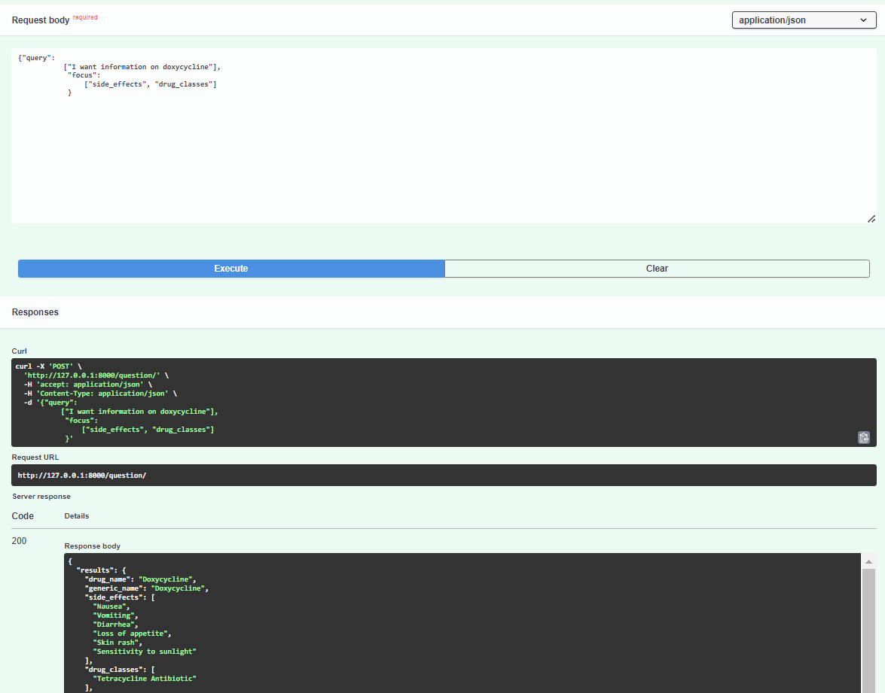

# Medication-Information-Search-Engine


#### This is a test assessment from **Lights on Heights**, The task is to develop an information retrieval system using Transformer based model and develop an endpoint to test the system performance.

### Steps to Reproduce.

1.  Create environmental variable:  `conda create -n langchain_env python==3.9.7`
2.  Install the required packages:   `pip install -r requements.txt`
3.  Run the note one cell at a time.
4.  Open the API endpoint to test the application: ` #Open http://127.0.0.1:8000/docs#/default to extract information from document`
5.  Generate an OpenAI API Key and place in the .env file
5. Request Body and Response Body

Open http://127.0.0.1:8000/docs#/default to extract information from document.
```
**Request Body**

             {"query": 
               ["I want information on doxycycline"],
                "focus": 
                    ["side_effects", "drug_classes"]
                }
    
**Response Body**

                {
                  "results": {
                    "drug_name": "Doxycycline",
                    "generic_name": "Doxycycline",
                    "side_effects": ["Nausea","Vomiting","Diarrhea","Rash","Photosensitivity"],
                    "drug_classes": [
                      "Tetracycline Antibiotic"
                    ],
                    "brand_names": ["Adoxa",Doryx","Monodox","Oracea","Vibramycin"],
                    "activity": "Unknown",
                    "related_drugs": ["Minocycline","Tetracycline",zithromycin"],
                    "rating": 7.1,
                    "no_of_reviews": 998,
                    "drug_link": "https://www.drugs.com/doxycycline.html",
                    "CSA": "N"
                  }
                }
```

### Link to application documentation.
> [API Documentation Links](https://docs.google.com/document/d/1_UkjLBW8heJmJJ_2bVCYWnk2BkXmeSX97_DXKakPLmw/edit?usp=sharing)

###  FastAPI EndPoint For Model

<p align="center"> 
  <kbd>
    <a href="https://github.com/okoliechykwuka/Medication-Information-Search-Engine" target="_blank">
  </a>
  </kbd>
</p>
